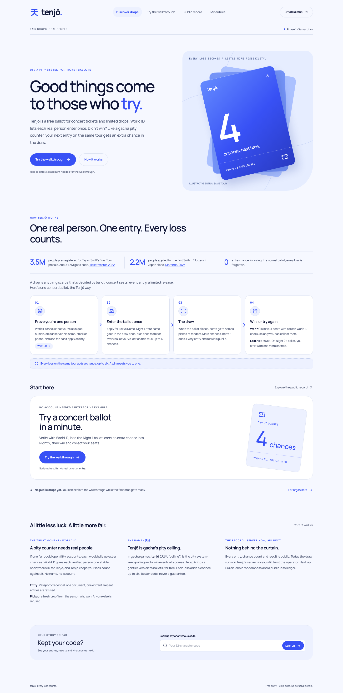
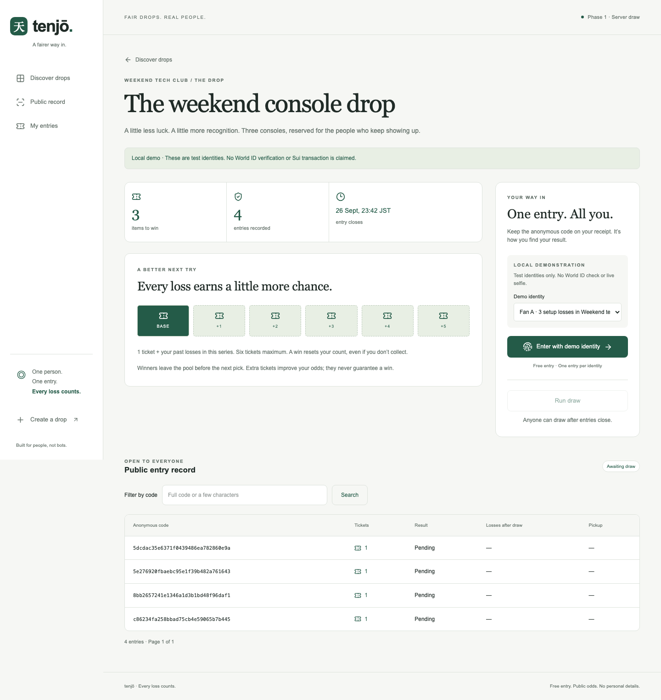

<a id="readme-top"></a>

<p align="center">
  
</p>

<h1 align="center">Tenjō · 天井</h1>

<p align="center"><strong>A free drop lottery where every loss earns another ticket.</strong></p>

<p align="center">
  <a href="https://tenjo-azure.vercel.app">Live site</a> ·
  <a href="https://tenjo-azure.vercel.app/demo">Try the walkthrough</a> ·
  <a href="#getting-started">Run the local demo</a> ·
  <a href="docs/PRD.md">Read the PRD</a> ·
  <a href="docs/OPERATIONS.md">Integration guide</a> ·
  <a href="https://github.com/Ducksss/tenjo/issues">Report an issue</a>
</p>


Scarce drops leave fans losing again and again. Tenjō remembers those losses: one base ticket, one extra per past loss in the same series, up to six total. A win resets the count. Every entry, weight and result has a public record.

**Try it locally without credentials.** Entry, duplicate refusal, weighted server draws, loss counts and pickup work with explicitly labelled demo identities. World ID integration is implemented and mock-tested; **the first real simulator proof is still pending credentials**. Production pickup awaits verified liveness. The [live site](https://tenjo-azure.vercel.app) is deployed on Vercel with hosted Postgres and an empty production database. World entry is unavailable until credentials are configured; a [browser-only walkthrough](https://tenjo-azure.vercel.app/demo) explains the rules with scripted outcomes and no saved entries. The full database-backed test-identity demo remains local. Sui is not implemented.

<details>
<summary>Contents</summary>

- [About the project](#about-the-project)
- [How it works](#how-it-works)
- [Getting started](#getting-started)
- [Usage](#usage)
- [Verification](#verification)
- [Roadmap](#roadmap)
- [Contributing](#contributing)
- [License](#license)
- [Contact](#contact)
- [Acknowledgments](#acknowledgments)

</details>

## About the project

World ID is intended to answer **who can enter**. Tenjō adds **what happens after they lose**: persistent series history, more tickets next time, and an inspectable draw. The Phase 1 implementation trusts the server and database operator; its record fingerprint is not independent proof of randomness.



_Real application capture of the public first-visit experience. Ticket artwork is original CSS; the screen is not a generated mockup._

| Working in the local demo | Rule                                                    |
| ------------------------- | ------------------------------------------------------- |
| Anonymous entry           | One code can enter each drop once                       |
| Pity tickets              | `1 + min(5, past losses)` within the same series        |
| Weighted draw             | Runs after close; each entrant can win once             |
| Settlement                | Losers gain one loss; winners reset to zero             |
| Pickup                    | Only the winning demo identity can collect, once        |
| Public record             | Search codes, inspect weights, winners and loss history |

No names, emails or phone numbers are stored. Codes are public and currently linkable across series. Entry is free; there are no deposits or real-money payments.

### Built with

Next.js 16 · React 19 · TypeScript · World ID IDKit 4 · Postgres / local PGlite · Playwright

The draw uses Node's `crypto.randomInt`. Hosted Postgres runs on Neon’s free plan in Singapore. **Sui is planned, not part of the current implementation.**

## How it works

One person gets one entry per drop, and every loss adds a ticket in the next draw of the same series.


### How the pieces connect


Locally, PGlite replaces Neon and labelled test identities stand in for World.

### What the server decides

Every entry and pickup runs these checks in this order. A stop never saves an entry or a pickup: dashed grey boxes mean not now, and red boxes mean refused.


"Proof valid" covers five checks: the identity settings haven't changed, the app and environment match, the challenge is fresh and unused, the credential and signal are present, and World confirms them with a matching nullifier.


In production, the first check stops every pickup until liveness is confirmed on the server. In staging, an explicit setting allows pickup, and each one is recorded as `untested-staging`.

## Getting started

### Prerequisites

- Node.js 22 or newer and npm.
- Git to clone the repository.
- No World credentials or external database needed for the local demo.

### Installation

```sh
git clone https://github.com/Ducksss/tenjo.git
cd tenjo
npm ci
npm run demo:seed
npm run dev:demo
```

Open [http://127.0.0.1:3000](http://127.0.0.1:3000). The seed creates a console drop with three items and clearly labelled setup history. Fan A starts with three losses, so their next entry gets four tickets.

Local data persists in `.data/tenjo`, which is excluded from Git. The seed is idempotent. **Stop the dev server before running scripts against that database:** local PGlite permits only one process at a time.

For real World staging, copy [.env.example](.env.example) to `.env.local` and follow the [World configuration guide](docs/OPERATIONS.md#configure-world-staging-and-a-real-drop). It documents `WORLD_APP_ID`, `WORLD_RP_ID`, `WORLD_ACTION`, `WORLD_RP_SIGNING_KEY`, the credential/protocol settings and `ADMIN_PASSWORD`. Keep signing keys server-only. Hosted deployments also need `DATABASE_URL` and `APP_ORIGIN`.

## Usage

**First visit:** [try the hosted walkthrough](https://tenjo-azure.vercel.app/demo). Follow a scripted loss, increased ticket weight, win/reset and pickup. It needs no credentials and does not call lottery APIs or save entries.

**Local database demo:**

1. Open **The weekend console drop** and enter as **Fan A**. The receipt shows four tickets.
2. Try Fan A again. The app refuses the duplicate without creating another entry.
3. Look up the receipt's anonymous code to inspect its history.
4. After entries close, confirm **Run draw**. Inspect the winners and updated loss counts.
5. Select a winning identity to collect; try a different identity to see pickup refused.

The default seeded drop closes 24 hours after its first setup. For a fresh two-minute rehearsal, stop the dev server and run:

```sh
npm run demo:rehearsal
```

Follow the launch command it prints. This creates an isolated database and preserves existing records.



[View the mobile capture](docs/assets/drop-mobile.png). These controls use local test identities, **not World's simulator or a live selfie**. Demo routes are restricted to explicitly enabled local, non-production use and cannot enter real drops.

### World ID trust boundary

At entry, the server checks the proof before saving a member or entry. At pickup, it requires a fresh proof of the winning identity. The document credential follows the PRD's uniqueness requirement; Orb is an explicit fallback that must be selected before real entries begin.

The byte-preserving verify call is in [src/lib/world.ts, lines 284–286](https://github.com/Ducksss/tenjo/blob/main/src/lib/world.ts#L284-L286). The server forwards the original body and checks the verified credential, nullifier, action, environment, nonce and purpose-bound signal. Mocked verifier tests do not establish real simulator compatibility.

Production pickup remains disabled until server-attested liveness is validated. An explicitly labelled staging fallback exists. See [operations and trust details](docs/OPERATIONS.md) and the [World integration debrief](docs/OPERATIONS.md#world-integration-debrief-in-progress). **Time to first real verification is still unmeasured. Sui package ID: not deployed.**

## Verification

```sh
npm run typecheck
npm run lint
npm test
npx playwright install chromium
npm run test:e2e
npm run build
npm run format:check
```

The implementation was checked with eleven backend tests, seven browser tests, type checking, lint, formatting and a production build. Tests cover duplicate races, draw timing, settlement, pickup refusal, proof forwarding and replay, dependency failure, keyboard access and mobile layouts. Browser tests start an isolated database and server on port 3100. If that port is occupied, run `TENJO_TEST_PORT=3112 npm run test:e2e`.

Real World credentials, production liveness and Sui require separate integration validation. Deployment instructions and the measured debrief are in the [operations guide](docs/OPERATIONS.md).

## Roadmap

- [x] Phase 1 local demo: entry, refusal, weighted draw, pity counts, pickup and public record.
- [x] Server-side World proof boundary with mocked verification tests.
- [x] Public repository, screenshots and setup documentation.
- [ ] Verify a real World simulator proof and refusal; confirm the credential choice.
- [ ] Validate pickup liveness or explicitly demonstrate the staging fallback.
- [x] Provision hosted Postgres and deploy to Vercel.
- [ ] Phase 2: Sui randomness, on-chain loss ledger, settlement and explorer links.
- [ ] Stretch: deposits/refunds and unclaimed-item handoff, after both phase gates pass.
- [ ] Record two clean rehearsals, complete the debrief and submit to ETHGlobal.

The [PRD](docs/PRD.md) covers the current product, acceptance criteria, release gates and open decisions. [Implementation notes](docs/IMPLEMENTATION.md) document the current choices and limits.

## Contributing

Open an [issue](https://github.com/Ducksss/tenjo/issues) to discuss changes, or submit a focused pull request with the relevant verification results. Read [AGENTS.md](AGENTS.md), [DESIGN.md](DESIGN.md) and [UX-CONTRACT.md](UX-CONTRACT.md) before changing the app. Keep setup identities labelled and never commit keys, database files or proof contents.

## License

No project license has been selected or added. Public visibility does not grant an open-source license. Dependency licenses remain their own.

## Contact

Maintained by [Chai / Ducksss](https://github.com/Ducksss). Use [repository issues](https://github.com/Ducksss/tenjo/issues) for project questions.

## Acknowledgments

- README structure adapted from [Best-README-Template](https://github.com/othneildrew/Best-README-Template), with project-specific content.
- World ID IDKit, Next.js, React, PGlite, Postgres, Playwright and Lucide power the implementation and tooling.
- The repository includes a pre-existing agent configuration template, separate from the lottery application.
- Visual direction inspired by [Invstor X by BRIX Templates](https://invstortemplate.webflow.io/): geometric type, navy on icy white, cobalt accents and spacious compositions. No template code or artwork is reused. The [design guide](DESIGN.md#reference-taste-invstor-x) records the translation.
- [Manrope](https://github.com/google/fonts/tree/main/ofl/manrope) is self-hosted under its bundled SIL Open Font License.
- The SVG marks and layered ticket artwork are original Tenjō assets; product screenshots show the running app. See the [asset guide](docs/assets/README.md) for sources, dimensions and usage.

[Back to top](#readme-top)
