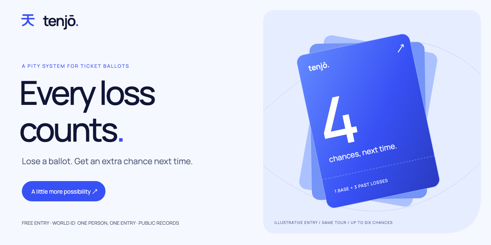
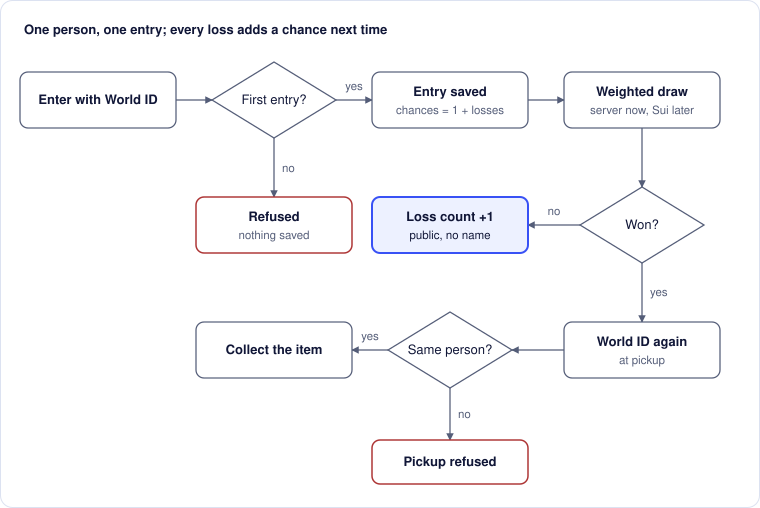

<a id="readme-top"></a>

<p align="center">
  
</p>

<h1 align="center">Tenjō · 天井</h1>

<p align="center"><strong>Lose a ballot, gain a chance.</strong><br>Gacha’s pity ceiling for ticket ballots. World ID gives each real person one entry. Sui holds the deposits, runs the draw and remembers every loss.</p>

<p align="center">
  <a href="https://tenjo-azure.vercel.app">Live site</a> ·
  <a href="https://tenjo-azure.vercel.app/#how">Try the walkthrough</a> ·
  <a href="https://tenjo-azure.vercel.app/architecture">How it’s built</a> ·
  <a href="move/tenjo/sources/ballot.move">Move package</a> ·
  <a href="#getting-started">Run it locally</a> ·
  <a href="docs/PRD.md">PRD</a>
</p>



Concert ballots and scarce drops leave fans losing again and again. [3.5 million people](https://business.ticketmaster.com/press-release/taylor-swift-the-eras-tour-onsale-explained/) pre-registered for the Eras Tour presale, and [about 2.2 million](https://mynintendonews.com/2025/04/23/japan-nintendo-confirms-2-2-million-people-applied-for-the-switch-2-lottery/) applied for the first Switch 2 lottery in Japan. Every loss is forgotten.

Tenjō gives ballots a pity counter. In gacha games, 天井 (_tenjō_, “ceiling”) is the pity system: keep pulling and your luck builds. Here, your name goes in the draw once, plus once for every ballot you’ve lost in the same series (a tour, shop or product line), up to six chances. A win resets you to one.

A pity counter only works if nobody can cheat it, and the two cheats need two networks:

- **Farming losses on fake accounts.** World ID proves each entrant is one unique human, so fifty accounts can’t pile up fifty pity counters.
- **Fiddling the draw, the money or the counts.** A Sui Move package commits the draw’s randomness from `sui::random`, holds entry deposits in escrow, refunds every loser in the settlement transaction and keeps the loss ledger on-chain.

## Status: what’s real right now

| Piece                         | Status                                                                                                                                                                                                                                                                                                                          |
| ----------------------------- | ------------------------------------------------------------------------------------------------------------------------------------------------------------------------------------------------------------------------------------------------------------------------------------------------------------------------------- |
| World ID (IDKit 4)            | Live on production for World's simulator and real World IDs, verified server-side byte for byte: 14 verified entries so far ([debrief](docs/OPERATIONS.md#world-integration-debrief)).                                                                                                                                          |
| Pity ledger, weighted draw    | Live. New drops draw on Sui testnet from a `sui::random` seed and keep the loss ledger on-chain; a local run without Sui draws on Tenjō’s server with `crypto.randomInt`.                                                                                                                                                       |
| Sui Move package              | Live on Sui testnet: [`tenjo::ballot`](move/tenjo/sources/ballot.move), package [`0x0d0f…3a65`](https://suiscan.xyz/testnet/object/0x0d0fd7d2dbedc277136bb41c3efc1048d1a2158197183899cda6a57a327b3a65) ([publish](https://suiscan.xyz/testnet/tx/EbbQyCRbv9Xv5LMvTZxK78fEUGjV1e1Lym4tSDF7Pe3G)), covered by 22 Move unit tests. |
| Paid drops (deposit → refund) | Live on testnet: the fan’s wallet locks a refundable deposit in the drop’s escrow, and one [settlement](https://suiscan.xyz/testnet/tx/DGAHZgteY7e1HMmmkCNsLwV67NzLqbGUoXN1Wci6RsuJ) pays the organiser for the winners’ seats and refunds every loser.                                                                         |
| Hosting                       | [tenjo-azure.vercel.app](https://tenjo-azure.vercel.app) on Vercel with Neon Postgres (Singapore).                                                                                                                                                                                                                              |

Every chain claim on the site links to its object or transaction on Suiscan.

<details>
<summary>Contents</summary>

- [How it works](#how-it-works)
- [Where World ID and Sui fit](#where-world-id-and-sui-fit)
- [Why Sui](#why-sui)
- [For judges](#for-judges)
- [Getting started](#getting-started)
- [Verification](#verification)
- [Roadmap](#roadmap)
- [AI usage](#ai-usage)
- [Acknowledgments](#acknowledgments)

</details>

## How it works

1. **Prove you’re one person.** World ID checks that you’re a unique human, on the server. No name, email or phone.
2. **Enter once.** Your chances are `1 + min(5, losses in this series)`. On a paid drop, your wallet locks a refundable deposit in the drop’s escrow on Sui.
3. **The draw.** After close, anyone can start it. `draw` commits 32 random bytes from `sui::random`, and `settle` picks winners deterministically from them, weighted by chances, without replacement.
4. **Win, or try again.** Winners pay for their seat from the deposit, receive a non-transferable Ticket object and claim with a fresh World ID check. Losers are refunded in the same transaction and start the next draw with one more chance.

The home page’s [How it works](https://tenjo-azure.vercel.app/#how) section plays these four steps as a 32-second animation of one fan’s two ballots, then lets you click through the same story.



<details>
<summary>What the server decides at entry and pickup</summary>

Every entry and pickup runs these checks in this order. A stop never saves an entry or a pickup.


"Proof valid" covers five checks: the identity settings haven't changed, the app and environment match, the challenge is fresh and unused, the credential and signal are present, and World confirms them with a matching nullifier.


</details>

## Where World ID and Sui fit

| Question                 | Who answers it                          | How                                                                                                                                                                                          |
| ------------------------ | --------------------------------------- | -------------------------------------------------------------------------------------------------------------------------------------------------------------------------------------------- |
| Who can enter?           | World ID (IDKit 4, passport credential) | RP-signed, purpose-bound challenge; the proof is forwarded byte for byte to World’s verify API; the nullifier becomes a 32-hex anonymous code ([src/lib/world.ts](src/lib/world.ts))         |
| Can this wallet pay in?  | Tenjō server → Sui                      | After World ID, the server signs an Ed25519 permit over `tenjo:enter:v1 ‖ drop ‖ code ‖ sender`; `ballot::enter` verifies it on-chain, so a permit can’t be reused by another wallet or drop |
| What is a loss worth?    | Sui (`Series` object)                   | `losses: Table<code, u64>`; chances are read on-chain at entry; only `settle` changes a count                                                                                                |
| Who wins?                | Sui (`sui::random`)                     | `entry fun draw` stores a seed with outcome-independent gas; `public fun settle` is deterministic, so [src/lib/sui-draw.ts](src/lib/sui-draw.ts) re-runs it in TypeScript and compares       |
| Where does the money go? | Sui (`Drop<T>` escrow)                  | Winners’ deposits go to the organiser as one coin; each loser’s deposit goes back to the wallet that paid it; winners get a soulbound `Ticket` (`key` without `store`)                       |
| Who can collect?         | World ID again                          | A fresh proof bound to `collect:<drop>:<challenge>` must resolve to a winning code, once                                                                                                     |

The server keeps what needs a person (World ID checks and pickup). The chain takes what needs no trust (randomness, money, loss counts). Postgres mirrors the chain for fast pages and the public record.

## Why Sui

- **Randomness nobody controls.** `sui::random` (object `0x8`) is produced jointly by Sui’s validators. Nobody can know or pick the result before the draw transaction runs: not Tenjō, the organiser or whoever presses “Run draw”.
- **One transaction settles everyone.** Settlement pays the organiser, refunds every loser, mints tickets and updates every pity counter, all or nothing. Sui batches [up to 1,024 payments in one atomic transaction](https://www.sui.io/payments).
- **Losses live in an object.** There’s no admin screen, database edit or quiet reset: only a settled draw can move a count.
- **Built for real money.** `Drop<T>` is generic over the coin, so the same contract takes testnet SUI today and stablecoins such as USDsui or USDC on mainnet.

Sui right now: [~300 ms to finality](https://www.sui.io/payments), [$0.00 stablecoin transfer fees on mainnet since 20 May 2026](https://www.sui.io/blog/sui-launches-gasless-stablecoin-transfers), [$1T+ in stablecoin transfers since August 2025](https://www.sui.io/blog/sui-launches-gasless-stablecoin-transfers), and [USDsui, a native stablecoin built on Bridge’s Open Issuance platform](https://www.sui.io/blog/sui-unveils-usdsui-native-stablecoin). A pay-if-you-win ballot needs exactly those rails.

## For judges

### World · Best use of IDKit

| Requirement                       | Where                                                                                                                                                                                |
| --------------------------------- | ------------------------------------------------------------------------------------------------------------------------------------------------------------------------------------ |
| IDKit in a functioning app        | [src/components/world-widget.tsx](src/components/world-widget.tsx), live on the drop pages                                                                                           |
| Verified server-side              | [`verifyWorldProof`](src/lib/world.ts): byte-preserving forward to `developer.world.org/api/v4/verify`, then per-credential result, nullifier, action, environment, nonce and signal |
| Trust moment + minimum credential | Fair access to a scarce benefit. Entry needs uniqueness, not identity, so it uses the passport credential (Orb fallback), and nothing about the fan is stored                        |
| Success plus alternative paths    | Duplicate entry, cancelled proof, missing credential, tampered proof, World outage and wrong collector are all refused without saving ([tests/world.test.ts](tests/world.test.ts))   |
| Integration debrief               | [docs/OPERATIONS.md](docs/OPERATIONS.md#world-integration-debrief-in-progress)                                                                                                       |

### Sui · DeFi & Payments

| Brief                                | Tenjō                                                                                                                                                                                                                                                                                                                                                                                                           |
| ------------------------------------ | --------------------------------------------------------------------------------------------------------------------------------------------------------------------------------------------------------------------------------------------------------------------------------------------------------------------------------------------------------------------------------------------------------------- |
| Programmable payment flow            | Deposit on entry, then one settlement: organiser paid, every loser refunded ([`settle`](move/tenjo/sources/ballot.move))                                                                                                                                                                                                                                                                                        |
| Vaults and capital allocation        | Each `Drop<T>` is an escrow vault whose allocation is decided by `sui::random` and the pity ledger                                                                                                                                                                                                                                                                                                              |
| Automation                           | Anyone can trigger the draw after close; settlement needs no operator decisions                                                                                                                                                                                                                                                                                                                                 |
| Financial abstraction for real users | Fans see “pay if you win, refunded if you don’t”. A loss turns into a future chance instead of a sunk cost                                                                                                                                                                                                                                                                                                      |
| Evidence                             | Move unit tests in [move/tenjo/tests](move/tenjo/tests); testnet [package](https://suiscan.xyz/testnet/object/0x0d0fd7d2dbedc277136bb41c3efc1048d1a2158197183899cda6a57a327b3a65), a [`sui::random` draw](https://suiscan.xyz/testnet/tx/8hCVmGFzq57mDy488F4bfha9AMdKc5qsYZt2vDAtHKdF) and the [settlement that refunds the loser](https://suiscan.xyz/testnet/tx/DGAHZgteY7e1HMmmkCNsLwV67NzLqbGUoXN1Wci6RsuJ) |

## Getting started

### Prerequisites

- Node.js 22 or newer and npm.
- For the Move package: the [Sui CLI](https://docs.sui.io/guides/developer/getting-started/sui-install) (`brew install sui`).
- No World credentials, wallet or external database needed for the local demo.

### Local demo

```sh
git clone https://github.com/Ducksss/tenjo.git
cd tenjo
npm ci
npm run demo:seed
npm run dev:demo
```

Open [http://127.0.0.1:3000](http://127.0.0.1:3000). The seed creates a console drop with three items and clearly labelled setup history. Fan A starts with three losses, so their next entry gets four chances. Local data persists in `.data/tenjo`. **Stop the dev server before running scripts against that database:** local PGlite allows one process at a time. For a fresh two-minute rehearsal, run `npm run demo:rehearsal` and follow the command it prints.

### Move package

```sh
cd move/tenjo
sui move build
sui move test
```

Publishing, testnet configuration (`SUI_NETWORK`, `SUI_PACKAGE_ID`, `SUI_ORGANISER_CAP_ID`, `SUI_SECRET_KEY`) and World staging setup are in the [operations guide](docs/OPERATIONS.md). Keep signing keys server-only.

## Verification

```sh
npm run typecheck
npm run lint
npm test
(cd move/tenjo && sui move test)
npx playwright install chromium
npm run test:e2e
npm run build
```

The TypeScript suite covers:

- duplicate-entry races, draw timing and settlement;
- pickup refusal, proof forwarding and replay;
- dependency failure;
- the TypeScript re-run of the Move draw.

The Move suite covers:

- permits, deposits, refunds and payout;
- the six-chance cap;
- every draw and settle gate.

Browser tests check keyboard access, mobile layouts and page overflow. They start an isolated database and server on port 3100, with Sui switched off; if that port is busy, run `TENJO_TEST_PORT=3112 npm run test:e2e`. Real World ID runs are measured in the [debrief](docs/OPERATIONS.md#world-integration-debrief).

## Roadmap

For a page-by-page wireframe, user journeys and current/optional architecture maps, open the self-contained [review map](docs/review-map.html) in a browser. The [26 September review](docs/REVIEW-2026-09-26.md) prioritises improvements and records the verification limits.

- [x] Entry, refusal, weighted draw, pity counts, pickup and public record.
- [x] Server-side World ID boundary, hosted on Vercel with Neon Postgres.
- [x] `tenjo::ballot` Move package: escrow, permits, `sui::random` draw, settlement, ledger, soulbound tickets, unit tests.
- [x] Warm capsule-machine redesign (see [DESIGN.md](DESIGN.md)).
- [x] Publish to Sui testnet, mirror on-chain draws and link every transaction.
- [x] Real World ID entries on production, for the simulator and real World IDs, with a measured debrief.
- [ ] Stablecoin deposits (USDsui/USDC) and sponsored gas, so fans never need SUI.
- [ ] Unclaimed-seat handoff to the next pick after a pickup window.

The [PRD](docs/PRD.md) covers acceptance criteria and open decisions. [Implementation notes](docs/IMPLEMENTATION.md) document the design choices and limits.

## AI usage

Built during ETHGlobal Tokyo 2026 with Claude Code as a pair programmer. Commits it helped write carry a `Co-Authored-By: Claude` trailer. Product decisions, prize scope and review stayed with the team. The spec files that steered the work are in the repo: [docs/PRD.md](docs/PRD.md) (requirements R1–R16), [DESIGN.md](DESIGN.md) (visual system) and [UX-CONTRACT.md](UX-CONTRACT.md) (interaction rules).

## License and contact

Tenjō is released under the [MIT License](LICENSE). Dependency licences remain their own. Maintained by [Chai / Ducksss](https://github.com/Ducksss); use [repository issues](https://github.com/Ducksss/tenjo/issues) for questions.

## Acknowledgments

- World ID IDKit, Sui and the Mysten Labs TypeScript SDK and dApp Kit, Next.js, React, PGlite, Postgres, Playwright and Lucide.
- The visual direction is distilled from the [Kidrise (Nurtiva) Webflow template](https://webflow.com/templates/html/kidrise-website-template) by LioWeb: its palette, Space Grotesk and Geist pairing, colour-blocked panels and badge buttons. No template code, images or copy are reused. The capsule machine and 天 mark are original. See [DESIGN.md](DESIGN.md#reference-taste-kidrise-nurtiva).
- [Space Grotesk](https://fonts.google.com/specimen/Space+Grotesk) and [Geist](https://fonts.google.com/specimen/Geist) (SIL OFL) are self-hosted through `next/font`.
- README structure adapted from [Best-README-Template](https://github.com/othneildrew/Best-README-Template).

[Back to top](#readme-top)
