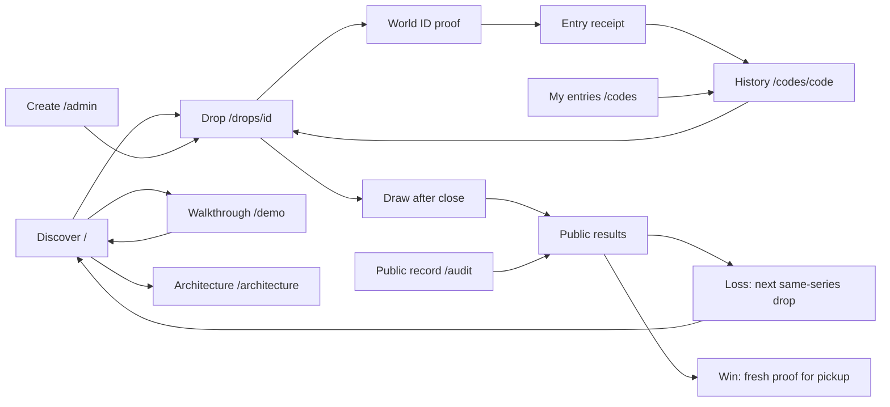
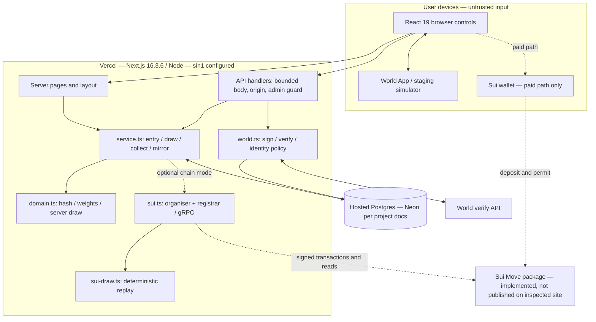
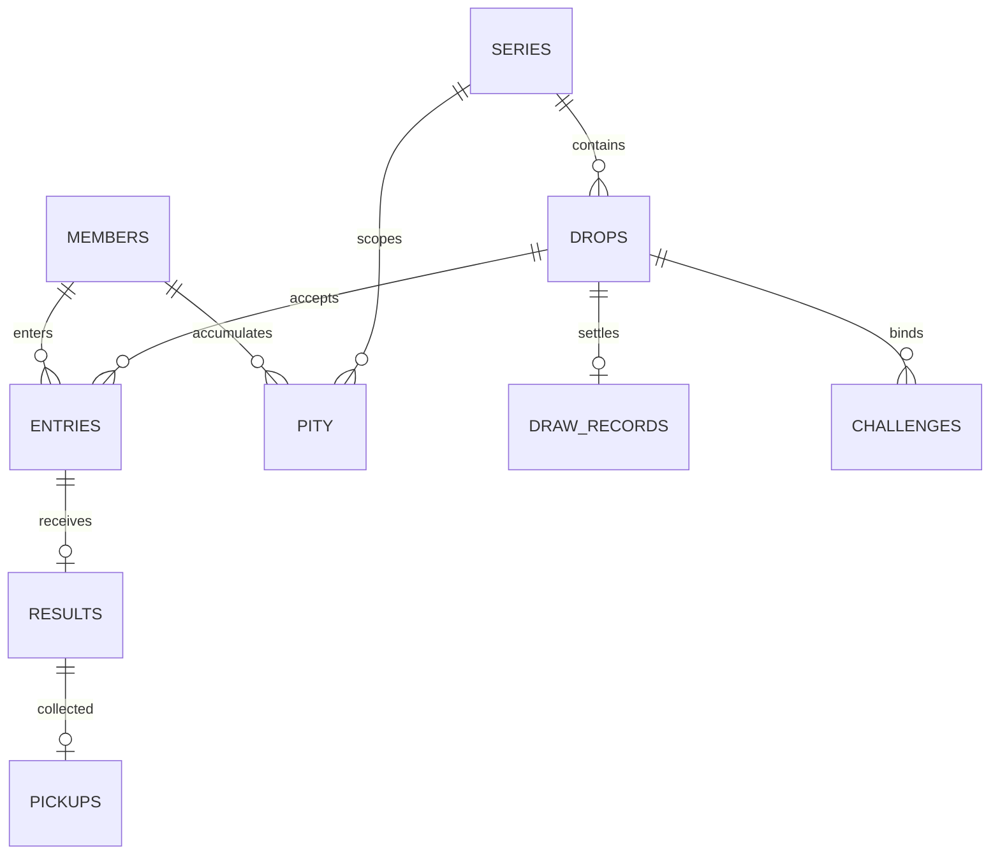

# Tenjō product and architecture review

Reviewed 26 September 2026 against repository snapshot `9da2fa82dc3fe839b3d10d661769a6d59a9451cc` and the hosted site. The accompanying [interactive review map](review-map.html) contains page skeletons, the original/revised homepage order, user journeys and architecture views. Open it in a browser; it is self-contained and makes no network requests. Print it to share all views.

## Assessment

The strongest idea is a simple, inspectable rule: one eligible identity, one entry, and `1 + min(5, losses)` chances within a series. The implementation already handles duplicate races, exactly-once settlement, undersubscribed draws and identity replay considerably better than a typical hackathon prototype. The browser-only walkthrough explains the benefit without requiring a wallet or World App.

The largest gap is operational evidence. The live site reports World staging and Sui not published. The server currently controls draws; the Move escrow is implemented, but this review did not observe a public testnet settlement or complete a real World proof. This is a credible prototype, not yet an independently verified production allocation system.

## Changes made in this review

| Change                                                   | User-visible result                                                                                            | Evidence                                                                       |
| -------------------------------------------------------- | -------------------------------------------------------------------------------------------------------------- | ------------------------------------------------------------------------------ |
| Move drop discovery immediately below the hero           | Visitors can find an opportunity before reading the technical pitch                                            | Browser assertion for the first two page sections                              |
| Respect the featured drop's price                        | A paid drop no longer advertises “Free to enter” in the hero; multiple-drop copy avoids a universal free claim | Production build and source review                                             |
| Distinguish Sui registration from a saved database entry | Receipt says registration is pending instead of claiming confirmed chances in the draw                         | Browser regression with a simulated pending API response                       |
| Expose `sui_status` and `drop_state` in code history     | A settled drop's unregistered entry says “Not included in draw”; the record explains that no loss was added    | Service regression first failed because these fields were missing, then passed |
| Share result vocabulary across history and public record | Pending registration is no longer confused with an outstanding draw                                            | Entry-state unit tests                                                         |
| Add application CI                                       | Pull requests and main pushes run install, type checking, lint, unit/service tests and build                   | Workflow added; local commands verified separately                             |

The changes preserve eligibility, chance weights, payout rules, identity scope and the database schema. No production data, keys, World policy or Sui deployment configuration was changed.

## Prioritised next work

| Priority                             | Finding and evidence                                                                                                                                                                                                                                                                                                                                            | Recommended acceptance criterion                                                                                                                                                                                                                             |
| ------------------------------------ | --------------------------------------------------------------------------------------------------------------------------------------------------------------------------------------------------------------------------------------------------------------------------------------------------------------------------------------------------------------- | ------------------------------------------------------------------------------------------------------------------------------------------------------------------------------------------------------------------------------------------------------------ |
| P1 before an on-chain pilot          | **Free registrations can be lost.** `registerPending` retries at most ten entries only when another entry or draw request arrives. After the 30-second grace period it stops. `settleFromChain` deliberately lists unmatched entries as unregistered. The existing service test reproduces this. This review fixes the misleading UI, not delivery reliability. | Durable outbox/worker, bounded backoff, pending-age monitoring and reconciliation; test outage through closing time and define the user remedy when an entry misses the chain.                                                                               |
| P1 before paid use                   | **Database and chain writes cannot commit atomically.** `createDrop` calls Sui while a SQL transaction is open; a chain success followed by SQL failure can leave an orphan even though the insert happened first. Global advisory locking also serialises all organiser writes.                                                                                | Persist an operation ID before broadcasting; record/recover transaction digest and reconcile the chain after timeouts or process crashes. Fault-inject after each external commit.                                                                           |
| P1 before paid use                   | **Paid-entry recovery is incomplete.** `DropActions.deposit` receives a digest, then confirms it; if confirmation fails, the UI does not retain a recovery action. The IDKit callback starts this async work without awaiting it, and the main busy state does not span the wallet/confirmation lifecycle.                                                      | Keep the digest and explicit stages; disable re-entry while submitting; offer “Check existing transaction” that retries only `/confirm`, including after reload. Verify wallet cancellation, wallet change, chain success/HTTP timeout and duplicate clicks. |
| P1 before claiming live integrations | **Configuration is being used as evidence of deployment.** `suiStatus.ready` checks three environment strings, not package existence. Some copy says “live” on that basis. World readiness similarly means keys are present.                                                                                                                                    | Track configured / reachable / end-to-end verified independently. Record a real World staging proof and an actual Sui publish, deposit, settlement and refund with explorer links.                                                                           |
| P1 before real pickup                | **Production pickup is intentionally disabled.** `worldConfig.pickupAllowed` permits only an explicitly enabled staging fallback; requesting presence does not establish server-attested liveness.                                                                                                                                                              | Demonstrate server-enforced liveness and wrong-identity refusal on the intended production credential before enabling collection.                                                                                                                            |
| P2                                   | **Returning visitors must keep a 32-character code.** The receipt is component state and disappears on refresh; `/codes` requires manual lookup.                                                                                                                                                                                                                | Offer a downloadable receipt and optional device-local saved history with a clear removal control. Never persist proofs or signing keys. Decide recovery/privacy policy first.                                                                               |
| P2                                   | **Public pseudonyms link activity across series.** The same code appears in all histories; paid entries also become linkable to an on-chain payer.                                                                                                                                                                                                              | Explain this before entry. Decide whether series-scoped identifiers fit the desired public-history model; changing it requires an explicit identity migration.                                                                                               |
| P2                                   | **Abuse controls and diagnostics are limited.** Challenge issuance writes to Postgres; admin and proof routes have no application rate limiter. `handle` hides unexpected errors without an operational event.                                                                                                                                                  | Rate limits at the deployment boundary, safe correlation IDs/error categories, alerts for verification failures, pending registrations and stale unsettled drops. Do not log proofs, passwords or nullifiers.                                                |
| P2                                   | **Scaling claims exceed this application's limits.** Both `domain.ts` and Move cap entrants at 300; platform-level payment figures are not Tenjō load tests. `generateMetadata` also loads the full public drop record, repeating expensive work.                                                                                                               | Label the actual capacity; load-test settlement and database contention; fetch just drop metadata and deduplicate request-scoped reads.                                                                                                                      |
| P2                                   | **Audit framing will become stale after Sui activation.** `/audit` has a hardcoded “Phase 1” introduction even if its list contains chain drops.                                                                                                                                                                                                                | Show the authority per drop, supporting mixed historical server and chain records.                                                                                                                                                                           |
| P2                                   | **Judges cannot open the linked private repository without access.** Confirmed via the GitHub connector's repository visibility. The live drop is named “Test” with “testing drop” as its description.                                                                                                                                                          | Provide judge access or an intentional public source release; prepare a clearly labelled, meaningful rehearsal drop and a short recorded end-to-end demonstration. No visibility change or live demo data edit was made here.                                |
| P3                                   | **Odds and eligibility need product decisions.** Six chances are a relative weight, not six tickets or a guaranteed win. Passport/document eligibility has different assurances from Orb-based proof of personhood.                                                                                                                                             | Explain eligibility and show a worked odds example without promising a fixed percentage for multi-winner draws. Test comprehension with new visitors and newcomers to the series.                                                                            |

## Page inventory and wireframes

All pages share: skip link → brand/navigation → environment badges → main → footer (architecture, public record, GitHub).

| Route           | Skeleton, in reading order                                                                                                                                                                                                | Main exits and states                                                                                                                           |
| --------------- | ------------------------------------------------------------------------------------------------------------------------------------------------------------------------------------------------------------------------- | ----------------------------------------------------------------------------------------------------------------------------------------------- |
| `/`             | Hero + capsule illustration → **drops (moved here)** → ballot problem/statistics → four-step explanation → architecture preview → Sui rationale → trust/identity + name explanation → code lookup                         | Open drop, walkthrough, public record, code history; empty discovery offers the walkthrough. Six drops are previewed.                           |
| `/drops/[id]`   | Back link → series/title/description/phase → environment notice → facts + chance rules + draw/results (left), entry/receipt/pickup (right) → Sui evidence → searchable public entry table → pagination → draw fingerprint | Upcoming / open / closed / settled; free or paid entry; refusal, pending registration, excluded entry, win/loss, pickup. Mobile stacks columns. |
| `/demo`         | Intro → scripted-example notice → four-step progress → scenario + action beside example receipt → example result table → restart                                                                                          | Enter → lose Night 1 → enter Night 2 → win → collect; duplicate and wrong-identity examples. No API mutations.                                  |
| `/codes`        | Heading → code field + lookup → public-linkability explanation → first-visit walkthrough invitation                                                                                                                       | Invalid input focuses field; valid code opens history.                                                                                          |
| `/codes/[code]` | Code heading → chance cards per series → entry/result/loss table → pagination → lookup another code                                                                                                                       | Links to drops; invalid/empty history; pending registration and excluded states now explicit.                                                   |
| `/audit`        | Heading → server-trust notice → paged drop list + phases → code lookup                                                                                                                                                    | Drop's `#record`, previous/next; empty state links to demo.                                                                                     |
| `/architecture` | Technical intro/status → architecture diagram → World pipeline → pity ledger → draw/Move excerpt → deposit flow → pickup → failure paths → partner briefs                                                                 | Informational page, links to sources and configured evidence.                                                                                   |
| `/admin`        | Organiser intro → drop details/series/items (+ deposit when configured) → JST schedule → password + publish                                                                                                               | Validation focuses field; leave guard; successful creation opens drop. No organiser account/session system.                                     |
| Error surfaces  | Loading message; route not found; error boundary with recovery                                                                                                                                                            | Retry and/or navigation back to discovery.                                                                                                      |

## System architecture

This is a Next.js monolith with an optional Sui execution path, not a set of independent backend services. Server-rendered pages read Postgres directly. Client controls call the Node route handlers. Sui is not active on the inspected hosted deployment.

### Three execution paths

1. **Current hosted free drop:** browser requests a five-minute RP-signed challenge; World App supplies a proof; server verifies exact bytes and the individual credential; SQL transaction locks series/drop, consumes challenge, saves entry and weight. After close, `crypto.randomInt` selects weighted winners without replacement; results, pity and record commit in one SQL transaction. Fresh verification gates pickup.
2. **Configured Sui free drop:** the same verified SQL entry commits as pending; server registers it on Sui using the organiser capability. The chain accepts registrations until app close + 30 seconds. Later entry/draw calls retry pending registrations. `draw` commits a random seed; `settle` chooses winners and updates the chain ledger; the server mirrors the outcome. Entries that never register receive no result or loss increment.
3. **Configured Sui paid drop:** wallet connects → World proof → server signs a permit bound to drop, code and wallet → wallet deposits SUI through `ballot::enter` → server verifies the transaction event and mirrors it. On settlement, winners' deposits go to the organiser, losers get refunds, and paid winners receive non-transferable Ticket objects. The app still records pickup separately in SQL. Stablecoins and sponsored gas are roadmap items, not a wired UI flow.

### HTTP surface

| Method/path                    | Responsibility                                    | Boundary                                                                |
| ------------------------------ | ------------------------------------------------- | ----------------------------------------------------------------------- |
| POST `/api/admin/drops`        | Create series/drop and optional Sui objects       | Organiser bearer password; same-origin check; Zod input                 |
| POST `/api/rp-signature`       | Issue expiring purpose/drop challenge             | Config and lifecycle checks                                             |
| POST `/api/drops/[id]/enter`   | Verify World proof, admit free entry              | Exact proof forwarding, challenge consumption and duplicate constraints |
| POST `/api/drops/[id]/permit`  | Verify proof; issue paid wallet permit            | Valid wallet, paid drop, signed drop/code/sender tuple                  |
| POST `/api/drops/[id]/confirm` | Mirror deposited entry                            | Successful chain event, package/drop/payer/price checks                 |
| POST `/api/drops/[id]/draw`    | Server settlement or chain draw/settlement/mirror | Public trigger after close; idempotent record                           |
| POST `/api/drops/[id]/collect` | Verify winner and record pickup once              | Fresh proof; staging-only presence gate                                 |
| GET `/api/drops/[id]/public`   | Entries, results, evidence, fingerprint           | Public, paginated, no-store                                             |
| GET `/api/codes/[code]`        | Cross-series history and pity                     | Public code lookup, paginated                                           |
| POST `/api/demo/[id]`          | Test identity entry/pickup/permit                 | Localhost + explicit demo + non-production + not Vercel                 |

### Data model

`entries` has a composite `(drop_id, member_code)` primary key. `results` and `pickups` reuse that identity. `pity` is `(series_id, member_code)`. `draw_records` stores algorithm, canonical JSON and SHA-256. `challenges` stores nonce, purpose, expiry and consumption. The independent `identity_policy` singleton pins identity configuration; `proof_log` stores categories and durations only. Raw World proofs/nullifiers are not retained. Paid entries also retain payer, amount, status and transaction digest.

### Move objects and authority

| Object                    | Owner/authority                 | Contents/use                                                                           |
| ------------------------- | ------------------------------- | -------------------------------------------------------------------------------------- |
| `OrganiserCap`            | Publisher/organiser             | Create series/drops and register free entries                                          |
| `Series`                  | Shared                          | Registrar public key, loss table, one active drop                                      |
| `Drop<T>`                 | Shared                          | Entrants/weights/payers, escrow, deadline, seed, winners, settled flag                 |
| `Ticket`                  | Paid winner; no `store` ability | Non-transferable win receipt; free entries with zero payer do not mint a wallet ticket |
| Random `0x8`, Clock `0x6` | Sui system                      | Seed and chain time                                                                    |

World proves the configured credential to the server, not directly to Move. The server's registrar/organiser remains trusted for admission. Sui removes discretion over settlement for the admitted pool; it does not prove the server admitted every eligible person. SQL row locks protect same-series ordering; an advisory lock and in-process queue protect organiser transactions. Local development uses one PGlite process; hosted operation requires Postgres. Hosted schema migration is explicit.

## Verification limits

Local unit/service tests, type checking, lint, production build and browser tests are recorded in the PR. Tests use isolated local databases and mocked Sui/World boundaries where appropriate. The review did not submit an entry, execute a financial transaction, run a live draw, publish Move, validate production liveness, benchmark 300 entrants or conduct a full security audit. Existing claims of earlier Move/localnet test results are repository documentation, not fresh results from this review.
